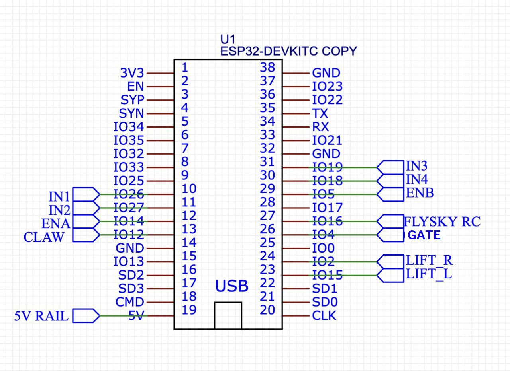

# 1023MB_LLC_Main

good stuff

# Prerequisites

## Install Libraries

1. Go to "Manage Libraries" in the Arduino IDE, and download/install the following libraries:
- [iBusBM](https://github.com/bmellink/IBusBM)
- [Arduino_APDS9960](https://github.com/1487quantum/Arduino_APDS9960/), `ESP32` branch
- [ESP32Servo](https://github.com/madhephaestus/ESP32Servo)

> **Note:** There is a slight modification that is required for the ESP32 to compile the APDS9960 library, comment out the `wire.end();` of `void APDS9960::end()` inside `src/Arduino_APDS9960.cpp`. Alternatively, refer [here](https://github.com/1487quantum/Arduino_APDS9960/blob/esp32/src/Arduino_APDS9960.cpp#L80).

## Components

| **Hardware**                        | **Actuators**                     | **Power**                         | **Electronics**                       |
| ----------------------------------- | --------------------------------- | --------------------------------- | ------------------------------------- |
| 3D printed parts                    | 12V motors x 4                    | Baseus 65W 20000mAh Powerbank x 1 | ESP32 devkitc 38 pins x 1             |
| MakerBeam Starter Kit               | Servomotor 360 (Arm) x 2          | USB C to DC output ZY12PDN x 1    | Flysky FS-i6S 10ch 2.4GHz x 1         |
| 2020 Aluminum Extrusion (200mm) x 4 | MG996 Servo 180 (Claw + Gate) x 2 |                                   | L298N Motor Driver x 1                |
| M3/M5 Nuts & Screws                 |                                   |                                   | 2 Pin Electrical Cable Connectors x 2 |
| Rubber wheels x 4                   |                                   |                                   |                                       |

## Schematics

## Set Up ESP32

1. To set up the ESP32, go to File -> Preferences and paste (https://dl.espressif.com/dl/package_esp32_index.json) in "Additional Board Managers URLs".

2. Go to Tools -> Board -> Boards Manager and search for ESP32. Install the package titled "ESP32".

3. For Windows systems, you need to go to this link and download the CP2120x Universal Windows Driver: https://www.silabs.com/developers/usb-to-uart-bridge-vcp-drivers.
4. Install the driver.

## Compile Sketch

1. Open `LLCMain.ino` (the main sketch) in Arduino IDE. It will open the main sketch and the other libraries used.

2. Compile and upload <code>LLCMain.ino</code> onto the ESP32. Ensure that pre-setup has already been completed before you start this step.
